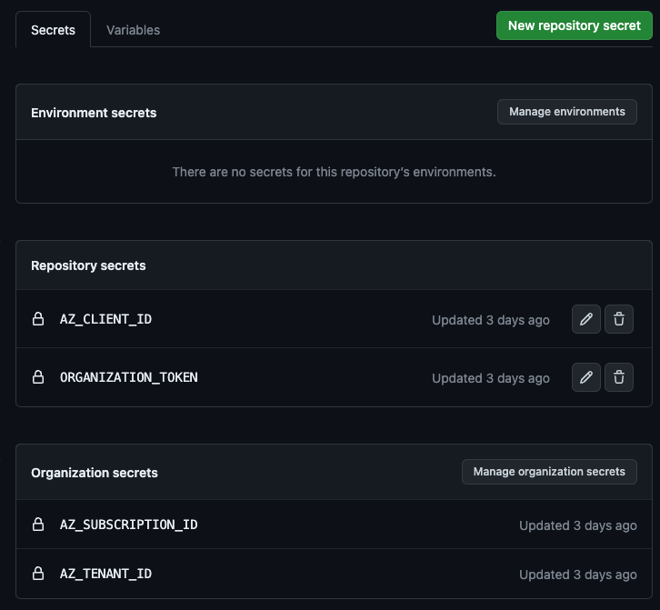

# Actions Workshop Deployment Environment

This repository contains preparation resources and script for the deployment step of the [GitHub Actions Workshop](https://github.com/actions-workshop/actions-workshop).

It's for trainers of this workshop to allow participants to deploy to any kind of infrastructure (currently only Azure) without having them create or bring their own accounts. 

This repository contains all explanations and scripts to easily set up all required infrastructure and be ready to conduct the workshop.

> [!NOTE]
> The cost for those deployments should most likely be a few cents and thus neglectable - see [Azure Costs](#azure-costs) for more details.

## 1. Simple Azure Web-App with Secret Authentication

This is the simplest possible deployment environment that can be created for the workshop. It consists of an Azure Service Principal using Secret authentication that has the required permissions to deploy a Web-App to a given Resource Group.

### 1.1 Prepare the Azure Account

#### Overivew: Required Azure Resources

| Azure Resource | Name | Additional Info |
| ---- | ------ | ------ |
| [AD App Registration & Service Principal][ad-docs-create-service-principal] | GitHub Actions Workshop Principal | This is the 'main' Service Principal used by this repository to create new participant specific Service Principals that allow them to deploy |
| [Client secrets][ad-docs-create-client-secret] | GitHub Actions Workshop Principal | A client secret for the created Service Principal |
| [Custom Role][ad-docs-create-custom-role-json] | GitHub Actions Workshop Role | Using [these permissions](./resources/simple/prepare-azure.sh#L30) (allowed in the scope of the subscription), this role allows the participants to create Resource Groups and conduct Azure Web App Deployments |
| [Role Assignment][ad-docs-create-role-assignment] | GitHub Actions Workshop Role | Assigned to the GitHub Actions Workshop Principal |

#### How to create these resources

If you want to use the Azure Portal, click on the links in the overview above for detailed instructions.

However, the easiest way to create all of the above is to use the [./resources/simple/prepare-azure.sh](./resources/simple/prepare-azure.sh) script. To run it, spin up a Codespace and execute the following:

1. Login to Azure with
    ```shell
    az login --use-device-code
    ```
2. Define the Subscription Id to be used
    ```shell
    export AZ_SUBSCRIPTION_ID=<your-subscription-id>
    ```
3. Execute the script:
    ```shell
    ./resources/simple/prepare-azure.sh
    ```

4. Make sure to store all the output values as Organization-Secrets as adviced in the log output:

    | Secret Name        | Value                                                    |
    | ------------------ | -------------------------------------------------------- |
    | AZ_SUBSCRIPTION_ID | The Azure Subscription ID used above                     |
    | AZ_TENANT_ID       | The Azure Tenant ID used above                           |
    | AZ_CLIENT_ID       | The Azure Client ID of the created service principal     |
    | AZ_CLIENT_SECRET   | The Azure Client Secret of the created servico principal |

### 1.2 Create a GitHub Organization

Execute the following steps:

1. [Create a (free) GitHub Organization](https://docs.github.com/en/github/setting-up-and-managing-organizations-and-teams/creating-a-new-organization-from-scratch)
2. [Add all the IDs from above as organization action secrets](https://docs.github.com/en/actions/reference/encrypted-secrets#creating-encrypted-secrets-for-an-organization)
3. [Invite all participants to the organization](https://docs.github.com/en/organizations/managing-membership-in-your-organization/inviting-users-to-join-your-organization) and advice them to put their [Actions Workshop Template Copy](https://github.com/actions-workshop/actions-workshop) into this organization

## 1.3 Conduct the Workshop

Let the participants follow the [005-deployment-azure-webapp.md Deployment step](https://github.com/actions-workshop/actions-workshop/tree/main/docs/005-deployment-azure-webapp.md) for the workshop. It contains all explanations in how to use the created Service Principal to deploy to Azure.

## 1.4 Cleanup

After the workshop, you can easily cleanup all created resources by executing the [./resources/simple/cleanup-azure.sh](./resources/simple/cleanup-azure.sh) script:

1. Login to Azure (if not already logged in)
    ```shell
    az login --use-device-code
    ```
2. Execute the script:
    ```shell
    ./resources/simple/cleanup-azure.sh
    ```
    
This script will:

1. Delete all Resource Groups that participants created (identified by the tag `purpose=GitHub Actions Workshop`) and all deployed services
2. It will prompt you to also delete the Service Principal and Custom Role that was created for the workshop. You can keep them if you want to use them for future workshops.

## 2. Issue-Ops Azure Web-App with OIDC Authentication

This is a more sophisticated way for deployment, in that it uses GitHub Issues to trigger the creation of a full deployment environment on Azure (hence the term 'Issue Ops'). Additionally, rather than relying on secrets, it will use OIDC Authentication to conduct the deployment in a secure manner.

The main idea is that participants of the workshop:

1. Open an issue from an issue-form in this repository giving their target repository
2. This triggers a workflow that will:
    1. create an participant specific **App Registration** with a **Service Principal** that allows the repository to deploy using **OIDC**
    2. create a **Resource Group** in Azure that the **App Registration** is allowed to deploy to by a **Custom Role**
    3. puts the required OIDC Information (`AZ_CLIENT_ID`, `AZ_SUBSCRIPTION_ID` and `AZ_TENANT_ID`) and the `ResourceGroup` Name (`AZ_RESOURCE_GROUP`) into the target repository as secrets and action variables

With these variables and secrets, participants can follow the [Issue Ops Deployment Steps](tbd.) of the Actions-Workshop. For a detailed explanation on how this works, see [Issue Ops Details](./docs/issue-ops-details.md).

### 2.1 Getting started

There are 3 pieces required to make this work:

1. [A GitHub Organization for the Actions Workshop with a copy of this Repository in it](#1-create-a-github-organization-for-the-workshop)
2. [A prepared Azure Account](#2-prepare-the-azure-account)
3. [A GitHub PAT for the Organization](#3-create-a-github-pat)

#### 2.1.1 Create a GitHub Organization for the Workshop

1. [Create a (free) GitHub Organization](https://docs.github.com/en/github/setting-up-and-managing-organizations-and-teams/creating-a-new-organization-from-scratch)
2. `Use this template` of this very repository to create a copy in the organization
    

#### 2.1.2 Prepare the Azure Account

##### Overview: Required Azure Resources

| Azure Resource | Name | Additional Info |
| ---- | ------ | ------ |
| [AD App Registration & Service Principal][ad-docs-create-service-principal] | GitHub Actions Worshop Administrator | This is the 'main' Service Principal used by this repository to create new participant specific Service Principals that allow them to deploy (App Registration and Service Principal are the same for our scenario here) |
| [Federated Credentials][ad-docs-federeated-github-credentials] | GitHub Actions Workshop Administrator | Using [this configuration](./resources/issue-ops/prepare-azure.sh#73), this is the OIDC configuration that is used by the participants create the participants Service Principals |
| [AD Admin Role Assignment][ad-docs-ad-admin-role-assignment] | Cloud Application Administrator | Built-In Azure AD Role, assigned to the GitHub Actions Workshop Administrator
| [Custom Role][ad-docs-create-custom-role-json] | GitHub Actions Workshop Administrator Role | Using [these permissions](./resources/issue-ops/prepare-azure.sh#126), this role allows the Administrator Service Principal has to create and cleanup resources |
| [Role Assignment][ad-docs-create-role-assignment] | GitHub Actions Workshop Administrator Role | Assigned to the GitHub Actions Workshop Administrator
| [Custom Role][ad-docs-create-custom-role-json] | Github Actions Worskhop Participant Role | Using [these permissions](./resources/issue-ops/prepare-azure.sh#168), this is  role allows participanrt's Service Principals to deployment Azure Web-Apps via OIDC to the created Resource Group |

##### How to create these resources

If you want to use the Azure Portal, click on the links in the overview above for detailed instructions.

However, the easiest way to create all of the above is to exeucte the [./resources/issue-ops/prepare-azure.sh](./resources/issue-ops/prepare-azure.sh) script. To run it, spin up a Codespace and execute the following:

1. Login to Azure with
    ```shell
    az login --use-device-code
    ```

2. Define the Subscription Id to be used
    ```shell
    export AZ_SUBSCRIPTION_ID=<your-subscription-id>
    ```

3. Execute the script:
    ```shell
    ./resources/issue-ops/prepare-azure.sh
    ```

4. Make sure to store all the output values as Organization- and Repository Secrets as adviced in the log output:

    | Secret Name        | Value                                                    | Scope |
    | ------------------ | -------------------------------------------------------- | ----- |
    | AZ_SUBSCRIPTION_ID | The Azure Subscription ID used above                     | Organization |
    | AZ_TENANT_ID       | The Azure Tenant ID used above                           | Organization |
    | AZ_CLIENT_ID       | The Azure Client ID of the created service principal     | Repository |

#### 2.1.3 Create a GitHub PAT

1. Create the following GitHub PAT:

    **Owner: Your Workshop Organization**
    **Scopes**:

    | Name | Scope | Reason |
    | ---- | ----- | ------ |
    | Actions | Read and write | To be able to trigger workflows |
    | Metadata | Read | Check if the repository exists and is in current org |
    | Secrets | Read and write | Place the required variables into the target repository |
    | Variables | Read and write | Place the required variables into the target repository |

2.  Create a  **Repository Secret `ORGANIZATION_TOKEN`**

After completion, you should have the following secrets in your copy of this deployment repository:



### 2.2 Conduct the Workshop

Hand out this repositorie's URL to your participants. Let them follow the [005-deployment-issue-ops.md Deployment step](https://github.com/actions-workshop/actions-workshop/tree/main/docs/005-deployment-azure-issue-ops.md) for the workshop, it contains the explanation on how to use this repositorie's issues to create a deployment environment.

### 2.3 Post Workshop Cleanup

After the workshop, you can easily cleanup all created resources by executing the [./resources/issue-ops/cleanup-azure.sh](./resources/issue-ops/cleanup-azure.sh) script:

1. Login to Azure (if not already logged in)
    ```shell
    az login --use-device-code
    ```

2. Execute the script:
    ```shell
    ./resources/issue-ops/cleanup-azure.sh
    ```

This will delete:
- All Resource Groups that participants created (identified by the tag `purpose=GitHub Actions Workshop`) with all their deployed services
- All Service Principals that were created for participants (identified by starting with the string `aw-`)
- All resources listed in [Overview: Required Azure Resources](#overview-required-azure-resources) that were created for the workshop (AD App Registration, Custom Roles, Role Assignments)

**You will be presented with a list of deleted resources and prompted to confirm before any deletion happens.**

> [!WARNING]
> As this script will remove all app registration / service principals that start with `aw-` (which stands for actions-workshop). You will get a list with confirmation before deletion, however, you should still make sure before tha you have no other app registrations / service principals that start with `aw-` in your subscription.

## Appendix: Azure Costs

You might be wondering: What will it cost to run this workshop in Azure the way?
**The answer: Most likely only a few cents.**

Participants will each create a single [Azure Web App Service](https://azure.microsoft.com/en-us/pricing/details/app-service/linux/) under a **Basic B1 Service Plan** which currently comes at €0.017/hour - so roughly 2 Cents / participant / hour.

As the Deployment Step is the last part of the workshop, participants will only have this service running for a few minutes or maximum hours - depending on how fast you will execute the cleanup scripts.


[ad-docs-create-service-principal]: https://learn.microsoft.com/en-us/azure/active-directory/develop/howto-create-service-principal-portal
[ad-docs-create-client-secret]: https://learn.microsoft.com/en-us/azure/active-directory/develop/howto-create-service-principal-portal#option-3-create-a-new-application-secret
[ad-docs-create-custom-role-json]: https://learn.microsoft.com/en-us/azure/role-based-access-control/custom-roles-portal#start-from-json
[ad-docs-create-role-assignment]: https://learn.microsoft.com/en-us/azure/role-based-access-control/role-assignments-portal
[ad-docs-federeated-github-credentials]: https://learn.microsoft.com/en-us/azure/developer/github/connect-from-azure?tabs=azure-portal%2Clinux
[ad-docs-ad-admin-role-assignment]: https://learn.microsoft.com/en-us/azure/active-directory/roles/manage-roles-portal
