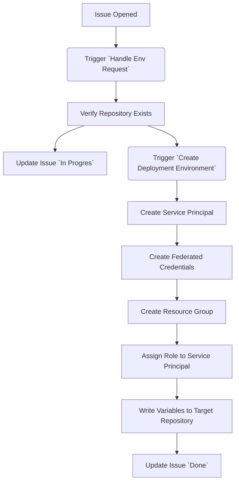

# deployment-environment

This is repository contains actions to allow the automatic creation of Azure Web App deployment environments. It is supposed to be used by a Trainer of the [GitHub Actions Workshop](https://github.com/actions-workshop/actions-workshop) to allow participants to deploy during the workshop without requiring their own Azure account.

The main idea is that participants of the workshop:

1. Open an issue from an issue-form in this repository giving their target repository
2. This triggers a workflow that will:
    1. create an App Registratoin with a Service Principal that allows the repository to deploy via OIDC
    2. create a `ResourceGroup` in Azure to deploy to
    3. puts the required OIDC information and `ResourceGroup` Name into the target repository as secrets and action variables

## Getting started

There are 3 pieces required to make this work:

1. Azure Admin Principal - this is so that you can actually create the deployment targets and further app registrations for the participants
2. A GitHub Organization for the Actions Workshop
3. A GitHub PAT in the scope of this organization
4. This repository copied into that Organization

### 1. Azure Admin Principal

### 2. GitHub Organization

### 3. GitHub PAT

### 4. This repository

## How it works in Detail

1. There is an [Issue-Template](./github/ISSUE_TEMPLATE/create-deployment-environment.md) that contains an issue-form to ask for the target repository from which the deployment is supposed to be triggered.
2. Opening this issue triggers the [Handle Env Request](./.github/workflows/handle-env-request.yml) workflow, which:
   1. Verifies that the target repository exists
   2. Puts the given information into the correct format
   3. Triggers the downstream [Create Deployment Environment](./.github/workflows/create-deployment-environment.yml) workflow
   4. Creates a comment on the issue with thente status of the deployment environment creation
3. The triggered [Create Deployment Environment](./.github/workflows/create-deployment-environment.yml) then executes several steps on Azure:
   1. It creates an **Azure AD Subscription** with a **Service Principal**
   2. It creates **Federated Credentials for OIDC Access** from the given repository and the `Staging` Environment
   3. It creates a **ResourceGroup** in Azure that acts as target for the deployment
   4. It assigns a **Role** that contains all permissions to deploy a Azure Web App to the Service Principal for the given ReosourceGroup
   5. It writes the variables `AZ_RESOURCE_GROUP` and the `AZ_CLIENT_ID` into the repositorie's action variables

Once done, the participants can just easily use the [./resources/deploy-action.yml](./resources/deploy-action.yml) workflow in their repository to deploy to the created environment.
