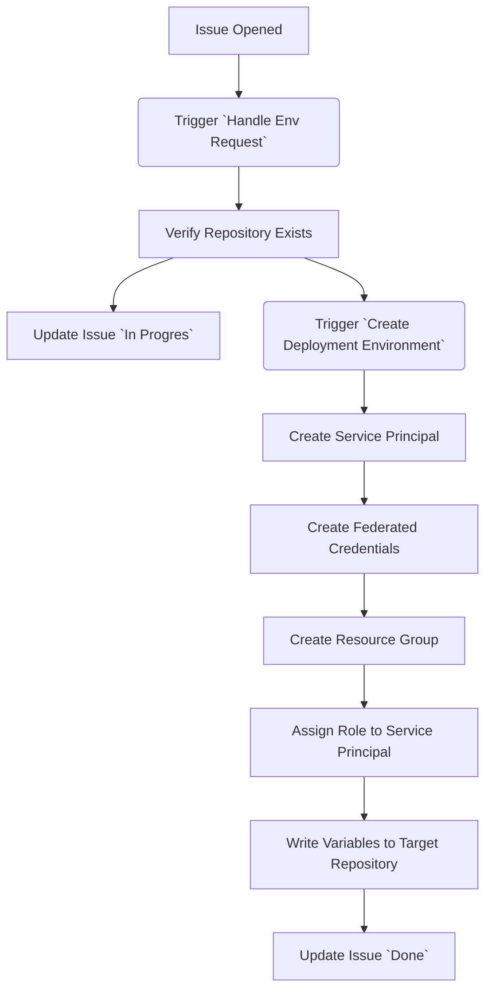

# Actions Workshop Deployment Environment

This repository contains preparation material for the deployment stept of the [GitHub Actions Workshop](https://github.com/actions-workshop/actions-workshop).

It's for trainers of this workshop to allow participants to deploy to any kind of infrastructure (like Azure) without having them create or bring their own accounts.

## 1. Simple Azure Web-App with Secret Authentication

This is the simplest possible deployment environment that can be created for the workshop. It consists of an Azure Service Principal using Secret authentication that has the required permissions to deploy a Web-App to a given Resource Group.

### 1.1 Prepare the Azure Account

The simplest way to go from here is to use the [./resources/simple/prepare-azure.sh](./resources/simple/prepare-azure.sh) script. To run it, spin up a Codespace and execute the following:

1. Login to Azure with
    ```shell
    az login
    ```
2. Put the subscription Id into a variable:
    ```shell
    export AZ_SUBSCRIPTION_ID=<your-subscription-id>
    ```
3. Execute the script:
    ```shell
    ./resources/simple/prepare-azure.sh
    ```

You will get an output with the following Ids:

- `AZ_CLIENT_ID` - the client id of the service principal
- `AZ_CLIENT_SECRET` - the client secret of the service principal
- `AZ_TENANT_ID` - the tenant id of the service principal
- `AZ_RESOURCE_GROUP` - the name of the resource group to deploy to

Use these Ids and put them into the organisation of the workshop in the next step.

### 1.2 Create a GitHub Organization

Execute the following steps:

1. [Create a free GitHub Organization](https://docs.github.com/en/github/setting-up-and-managing-organizations-and-teams/creating-a-new-organization-from-scratch)
2. [Add all the IDs from above as organization action secrets](https://docs.github.com/en/actions/reference/encrypted-secrets#creating-encrypted-secrets-for-an-organization)
3. [Invite all participants to the organization](https://docs.github.com/en/organizations/managing-membership-in-your-organization/inviting-users-to-join-your-organization) and advice them to put their [Actions Workshop Template Copy](https://github.com/actions-workshop/actions-workshop) into this organization

### 1.3 Cleanup

After the workshop, you can easily cleanup all created resources by executing the [./resources/simple/cleanup-azure.sh](./resources/simple/cleanup-azure.sh) script:

1. Login to Azure with
    ```shell
    az login
    ```
2. Put the subscription Id into a variable:
    ```shell
    export AZ_SUBSCRIPTION_ID=<your-subscription-id>
    ```
3. Execute the script:
    ```shell
    ./resources/simple/cleanup-azure.sh
    ```
    
This script will:

1. Delete all Resource Groups that participants created (identified by the tag `purpose=GitHub Actions Workshop`) and all deployed services
2. It will prompt you to also delete the Service Principal and Custom Role that was created for the workshop. You can keep them if you want to use them for future workshops.

## 2. Issue-Ops Azure Web-App with OIDC Authentication

This is a more complex way for deployment, in that it uses GitHub Issues to trigger the creation of a full deployment environment on Azure (hence the term 'Issue Ops'). Additionally, rather than relying on secrets, it will use OIDC Authentication to conduct the deployment in a secure manner.

The main idea is that participants of the workshop:

1. Open an issue from an issue-form in this repository giving their target repository
2. This triggers a workflow that will:
    1. create an **App Registration** with a **Service Principal** that allows the repository to deploy to a certain Resource Group via OIDC
    2. create a `ResourceGroup` in Azure that the **App Registration** is allowed to deploy to by a **Role**
    3. puts the required OIDC Information (`AZ_CLIENT_ID`, `AZ_SUBSCRIPTION_ID` and `AZ_TENANT_ID`) and the `ResourceGroup` Name into the target repository as secrets and action variables

With these variables and secrets, participants can follow the OIDC-Deployment-Steps.

### Getting started

There are 3 pieces required to make this work:

1. Azure Admin Principal - this is so that you can actually create the deployment targets and further app registrations for the participants
2. A GitHub Organization for the Actions Workshop with a copy of this repository template in it
3. A GitHub PAT in the scope of this organization

### 1. Azure Admin Principal


### 2. GitHub Organization

### 3. GitHub PAT

1. Create the following GitHub PAT:

    **Owner: Your Workshop Organization**
    **Scopes**:

    | Name | Scope | Reason |
    | ---- | ----- | ------ |
    | Actions | Read and write | To be able to trigger workflows |
    | Metadata | Read | Check if the repository exists and is in current org |
    | Secrets | Read and write | Place the required variables into the target repository |
    | Variables | Read and write | Place the required variables into the target repository |

2.  Create a  **Repository Secret `ORGANIZATION_TOKEN`


## How it works in Detail



1. There is an [Issue-Template](./github/ISSUE_TEMPLATE/create-deployment-environment.md) that contains an issue-form to ask for the target repository from which the deployment is supposed to be triggered.
2. Opening this issue triggers the [Handle Env Request](./.github/workflows/handle-env-request.yml) workflow, which:
   1. Verifies that the target repository exists
   2. Puts the given information into the correct format
   3. Triggers the downstream [Create Deployment Environment](./.github/workflows/create-deployment-environment.yml) workflow
   4. Creates a comment on the issue with thente status of the deployment environment creation
3. The triggered [Create Deployment Environment](./.github/workflows/create-deployment-environment.yml) then executes several steps on Azure:
   1. It creates an **Azure AD Subscription** with a **Service Principal**
   2. It creates **Federated Credentials for OIDC Access** from the given repository and the `Staging` Environment
   3. It creates a **ResourceGroup** in Azure that acts as target for the deployment
   4. It assigns a **Role** that contains all permissions to deploy a Azure Web App to the Service Principal for the given ReosourceGroup
   5. It writes the variables `AZ_RESOURCE_GROUP` and the `AZ_CLIENT_ID` into the repositorie's action variables

Once done, the participants can just easily use the [./resources/deploy-action.yml](./resources/deploy-action.yml) workflow in their repository to deploy to the created environment.
