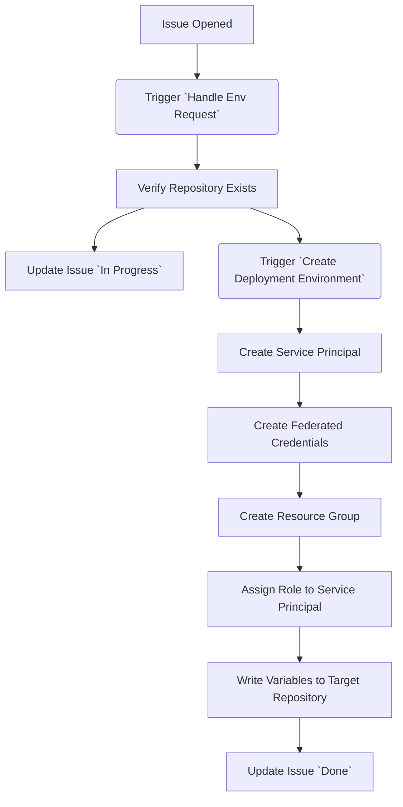

# Issue-Ops approach in Detail

## How it works in Detail

1. There is an [Issue-Template](./github/ISSUE_TEMPLATE/create-deployment-environment.md) that contains an issue-form to ask for the target repository from which the deployment is supposed to be triggered.
2. Opening this issue triggers the [Handle Env Request](./.github/workflows/handle-env-request.yml) workflow, which:
   1. Verifies that the target repository exists
   2. Puts the given information into the correct format
   3. Triggers the downstream [Create Deployment Environment](./.github/workflows/create-deployment-environment.yml) workflow
   4. Creates a comment on the issue with the status of the deployment environment creation
3. The triggered [Create Deployment Environment](./.github/workflows/create-deployment-environment.yml) then executes several steps on Azure:
   1. It creates an **Azure AD Subscription** with a **Service Principal**
   2. It creates **Federated Credentials for OIDC Access** from the given repository and the `Staging` Environment
   3. It creates a **ResourceGroup** in Azure that acts as target for the deployment
   4. It assigns a **Role** that contains all permissions to deploy a Azure Web App to the Service Principal for the given ResourceGroup
   5. It writes the variables `AZ_RESOURCE_GROUP` and the `AZ_CLIENT_ID` into the repository's action variables

Once done, the participants can just easily use the [./resources/deploy-action.yml](./resources/deploy-action.yml) workflow in their repository to deploy to the created environment.
